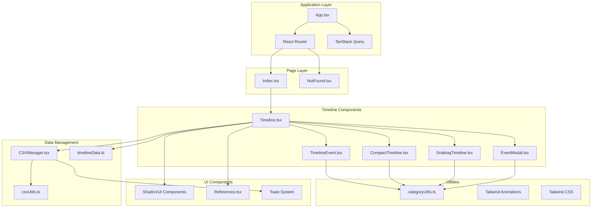

# AI Timeline Explorer

An interactive web application for exploring the history of Artificial Intelligence through multiple timeline visualizations. Built with React, TypeScript, and modern web technologies.

## 🚀 Live Demo

**URL**: https://lovable.dev/projects/81635285-c933-4087-a275-3189a82f8748

## 📋 Table of Contents

- [Features](#features)
- [Master Data Source](#master-data-source)
- [Architecture](#architecture)
- [Technology Stack](#technology-stack)
- [Installation & Setup](#installation--setup)
- [CSV Data Management](#csv-data-management)
- [Project Structure](#project-structure)
- [Usage Guide](#usage-guide)
- [Development](#development)
- [Deployment](#deployment)
- [Contributing](#contributing)

## ✨ Features

### 🔄 Multiple Timeline Views
- **Detailed View**: Traditional vertical timeline with alternating left/right event cards
- **Horizontal View**: Compact horizontal scrollable timeline
- **Snaking View**: Dynamic grid layout with intelligent connecting lines that adapt to content

### 🎯 Interactive Event Exploration
- Click any event to open detailed modal with comprehensive information
- Hover effects with smooth animations and scaling
- Related resource links for deeper research
- Category-based color coding for visual organization

### 📊 CSV Data Management
- **Import**: Upload CSV files with comprehensive validation
- **Export**: Download timeline data in standardized CSV format
- **Validation**: Real-time error detection and reporting
- **Security**: Content sanitization and file size limits
- **Format Support**: Flexible year formats (YYYY, YYYY-YYYY, YYYYs)

### 🎨 Modern UI/UX
- Responsive design that works on all devices
- Dark theme with gradient accents
- Smooth animations and transitions
- Glass-morphism effects and backdrop blur
- Performance-optimized rendering

### 📱 Accessibility & Performance
- Keyboard navigation support
- Screen reader friendly
- Optimized animations with `will-change` properties
- Debounced hover events to prevent rapid state changes
- Layout optimization to prevent content shifting

## 🏗️ Architecture



### Component Architecture

- **App.tsx**: Root application with routing and providers
- **Timeline.tsx**: Main orchestrator managing view states and data
- **View Components**: Specialized timeline visualizations
- **CSVManager.tsx**: Complete data import/export solution
- **Utils**: Shared business logic and styling functions

### Data Flow

1. **Static Data**: Initial timeline data from `timelineData.ts`
2. **Dynamic Import**: CSV data processed through validation pipeline
3. **State Management**: React state for view switching and interactions
4. **Event Handling**: User interactions trigger modal displays and view changes

## 🏗️ Master Data Source

### 🗂️ Authoritative Timeline Data

The master timeline dataset for this application is maintained in the GitHub repository:

**📂 File Location**: [`src/data/timelineEvents.json`](https://github.com/malminhas/ai-chronicle-view/blob/main/src/data/timelineEvents.json)

This JSON file contains the authoritative collection of AI timeline events, including:
- **100+ curated events** spanning from 1936 to 2030
- **Comprehensive descriptions** for each milestone
- **Categorized events** with proper color coding
- **Research references** and source links
- **Standardized formatting** for consistency

### 🔄 Contributing to Master Data

Users can contribute to the master timeline data by:

1. **Downloading the current dataset**: Access the JSON file directly from GitHub
2. **Making improvements**: Add new events, update descriptions, or add references
3. **Submitting changes**: Create pull requests with your updates
4. **Community review**: Changes are reviewed before being merged into the master dataset

### 🏠 Local vs. Master Data

- **Master Data**: The GitHub `timelineEvents.json` serves as the foundation for all users
- **Local Customizations**: CSV imports create personalized views stored in browser localStorage
- **Persistence**: Local changes are device-specific and don't affect the master dataset
- **Synchronization**: Users can reset to master data or export local changes for contribution

## 🛠️ Technology Stack

### Core Framework
- **React 18.3.1** - Modern React with concurrent features
- **TypeScript** - Type-safe development
- **Vite** - Fast build tool and development server

### UI & Styling
- **Tailwind CSS** - Utility-first CSS framework
- **Shadcn/UI** - High-quality component library
- **Lucide React** - Beautiful icon library
- **Custom Animations** - Tailwind-based animation system

### State & Data Management
- **TanStack Query** - Server state management
- **React Hook Form** - Form handling
- **Zod** - Runtime type validation

### Development Tools
- **ESLint** - Code linting
- **PostCSS** - CSS processing
- **TypeScript Config** - Strict type checking

## 🚀 Installation & Setup

### Prerequisites

- **Node.js** (v16 or higher) - [Install with nvm](https://github.com/nvm-sh/nvm#installing-and-updating)
- **npm** or **yarn** package manager

### Local Development Setup

1. **Clone the repository**
   ```bash
   git clone <YOUR_GIT_URL>
   cd <YOUR_PROJECT_NAME>
   ```

2. **Install dependencies**
   ```bash
   npm install
   # or
   yarn install
   ```

3. **Start development server**
   ```bash
   npm run dev
   # or
   yarn dev
   ```

4. **Open in browser**
   - Navigate to `http://localhost:5173`
   - The app will auto-reload on file changes

### Alternative Development Methods

#### GitHub Codespaces
1. Go to the repository main page
2. Click "Code" → "Codespaces" → "New codespace"
3. Edit files directly in the cloud environment

#### Direct GitHub Editing
1. Navigate to desired files in the repository
2. Click the "Edit" (pencil) icon
3. Make changes and commit directly

## 📄 CSV Data Management

### 🔒 Individual User Data

**Important**: Each user gets their own personalized timeline view stored locally in their browser. CSV imports allow users to:

- **Customize their view**: Import additional events or modify existing ones
- **Build on master data**: Local changes supplement the master `timelineEvents.json` dataset
- **Maintain independence**: Changes don't affect other users or the master data
- **Experiment freely**: Test different timeline configurations without consequences

### 📥 Relationship to Master Data

- **Foundation**: All users start with the master dataset from `timelineEvents.json`
- **Enhancement**: CSV imports add to or override the master data locally
- **Contribution Path**: Users can export their improvements and submit them to update the master dataset
- **Reset Option**: Users can always return to the original master dataset

### Import Functionality

The application supports importing timeline data via CSV files with comprehensive validation. **All imports are local to your browser and won't affect other users.**

#### CSV Format Requirements

| Column | Type | Format | Required |
|--------|------|--------|----------|
| year | string | `YYYY`, `YYYY-YYYY`, or `YYYYs` | ✅ |
| event | string | Max 500 characters | ✅ |
| description | string | Max 2000 characters | ✅ |
| category | string | Must match valid categories | ✅ |

#### Valid Categories

```
philosophical-foundations, early-ai, symbolic-ai, ai-winter, 
machine-learning, rise-of-statistical-methods, technological-milestone, 
generative-ai, transformers, ai-applications, ai-ethics, 
multimodal-ai, open-source-ai, ai-future
```

#### Example CSV Format

```csv
year,event,description,category
"1950","Turing Test","Alan Turing proposes the Turing Test...","philosophical-foundations"
"1956","Dartmouth Conference","The term 'Artificial Intelligence' is coined...","early-ai"
"2017","Attention Is All You Need","Introduction of the Transformer architecture...","transformers"
```

### Security Features

- **File Type Validation**: Only `.csv` files accepted
- **Size Limits**: Maximum 5MB file size
- **Content Sanitization**: Automatic detection and blocking of malicious content
- **XSS Prevention**: Script tags and dangerous patterns filtered out

### Export Functionality

- **One-Click Export**: Download your current personalized timeline data as CSV
- **User-Specific Data**: Export reflects your individual timeline, which may differ from other users
- **Standardized Format**: Consistent column structure
- **Proper Escaping**: Handles quotes and special characters correctly

### Validation System

The CSV validation system provides detailed error reporting:

- **Structural Validation**: Checks for required columns and proper format
- **Data Validation**: Verifies year formats and category values
- **Content Security**: Scans for potentially malicious content
- **User Feedback**: Clear error messages with row-specific details

## 📁 Project Structure

```
src/
├── components/           # React components
│   ├── ui/              # Shadcn/UI base components (read-only)
│   ├── Timeline.tsx     # Main timeline orchestrator
│   ├── TimelineEvent.tsx     # Individual event cards
│   ├── CompactTimeline.tsx   # Horizontal view component
│   ├── SnakingTimeline.tsx   # Grid view component
│   ├── EventModal.tsx        # Event detail modal
│   ├── CSVManager.tsx        # CSV import/export
│   └── References.tsx        # Bibliography section
├── data/                # Static data
│   ├── timelineData.ts  # Legacy static data (deprecated)
│   └── timelineEvents.json  # Master timeline dataset (GitHub source)
├── utils/               # Utility functions
│   ├── categoryUtils.ts # Color/label mappings
│   └── csvUtils.ts      # CSV processing logic
├── pages/               # Route components
│   ├── Index.tsx        # Main application page
│   └── NotFound.tsx     # 404 error page
└── hooks/               # Custom React hooks
    └── use-toast.ts     # Toast notification hook
```

**Key Data Files**:
- **`timelineEvents.json`**: Master dataset maintained on GitHub - the authoritative source
- **`timelineData.ts`**: Legacy static data file (now deprecated in favor of JSON master data)

## 📖 Usage Guide

### Switching Timeline Views

1. **Compact View**: Grid-based layout with snaking connections
2. **Horizontal View**: Scrollable horizontal timeline
3. **Detailed View**: Traditional vertical timeline

Use the view toggle buttons at the top of the timeline to switch between modes.

### Exploring Events

- **Hover**: See preview information and click hints
- **Click**: Open detailed modal with descriptions and related links
- **Categories**: Events are color-coded by AI development category

### Managing Data

#### Importing CSV Data
1. Click "Import CSV" in the CSV Management section
2. Select a properly formatted CSV file
3. Review any validation errors
4. Successfully imported data replaces current timeline

#### Exporting Data
1. Click "Export CSV" to download current timeline data
2. File saves as `ai-timeline-data.csv`
3. Use exported data as template for new imports

## 👨‍💻 Development

### Available Scripts

```bash
npm run dev          # Start development server
npm run build        # Build for production
npm run preview      # Preview production build
npm run lint         # Run ESLint
```

### Adding New Events

To add events to the master timeline dataset:

1. **Access the master file**: Download [`timelineEvents.json`](https://github.com/malminhas/ai-chronicle-view/blob/main/src/data/timelineEvents.json)
2. **Follow the format**: Use the existing event structure
3. **Submit via GitHub**: Create a pull request with your additions
4. **Community review**: Changes are reviewed for accuracy and formatting

Example event format:
```json
{
  "year": "2024",
  "event": "New AI Breakthrough",
  "description": "Detailed description of the event...",
  "category": "ai-future",
  "references": ["https://example.com/source"]
}
```

### Creating New Categories

1. Add category to `categoryUtils.ts` color mappings
2. Update CSV validation in `csvUtils.ts`
3. Add category to valid categories list

### Performance Considerations

- Components use `will-change` for optimized animations
- Hover events are debounced to prevent rapid state changes
- Layout shifts are minimized with pre-allocated space

## 🚀 Deployment

### Using Lovable (Recommended)

1. Open your [Lovable Project](https://lovable.dev/projects/81635285-c933-4087-a275-3189a82f8748)
2. Click "Share" → "Publish"
3. Your app will be deployed automatically

### Custom Domain Setup

1. Navigate to Project → Settings → Domains in Lovable
2. Click "Connect Domain"
3. Follow the setup instructions
4. Note: Requires paid Lovable plan

### Manual Deployment

```bash
npm run build
# Deploy the `dist` folder to your hosting provider
```

## 🤝 Contributing

### Getting Started

1. Fork the repository
2. Create a feature branch: `git checkout -b feature/amazing-feature`
3. Make your changes following the established patterns
4. Test your changes thoroughly
5. Submit a pull request

### Contributing to Master Timeline Data

**Updating the Authoritative Dataset**:

1. **Fork the repository** on GitHub
2. **Download the master data**: Access [`timelineEvents.json`](https://github.com/malminhas/ai-chronicle-view/blob/main/src/data/timelineEvents.json)
3. **Make your changes**: Add events, update descriptions, add references
4. **Validate your data**: Ensure proper JSON formatting and required fields
5. **Submit a pull request**: Include a clear description of your additions/changes
6. **Community review**: Changes are reviewed for accuracy and formatting

**Data Quality Guidelines**:
- Ensure historical accuracy with proper references
- Follow the established category system
- Include meaningful descriptions (not just event names)
- Add credible source links in the references array
- Maintain consistent formatting and style

### Coding Standards

- Use TypeScript for all new code
- Follow existing component patterns
- Add proper error handling
- Include hover states and animations
- Maintain responsive design principles

### Adding Features

- Create focused, single-purpose components
- Use existing utility functions when possible
- Follow the established color and animation patterns
- Add appropriate validation for user inputs

## 📚 Additional Resources

- [Lovable Documentation](https://docs.lovable.dev/)
- [React Documentation](https://react.dev/)
- [Tailwind CSS](https://tailwindcss.com/)
- [Shadcn/UI Components](https://ui.shadcn.com/)
- [TanStack Query](https://tanstack.com/query/latest)

## 📄 License

This project was created with [Lovable](https://lovable.dev) and is available for educational and development purposes.

---

**Built with ❤️ using [Lovable](https://lovable.dev)**
